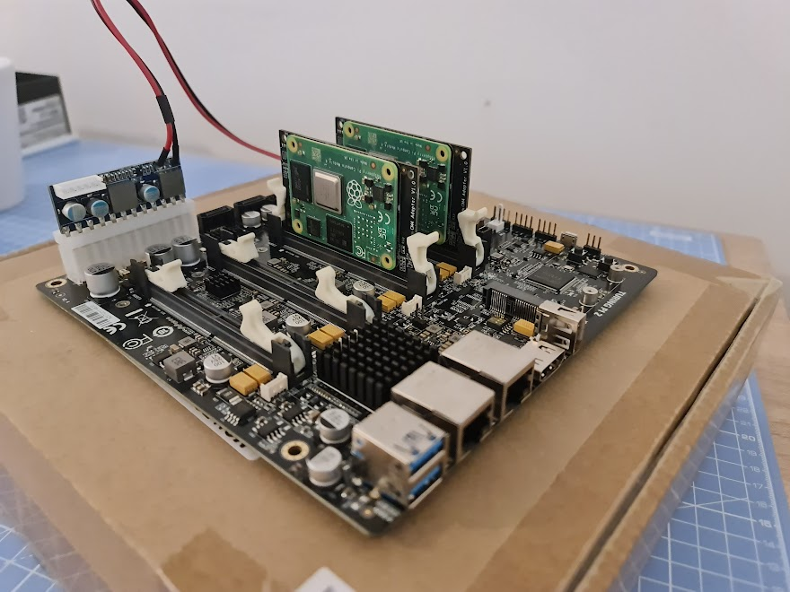
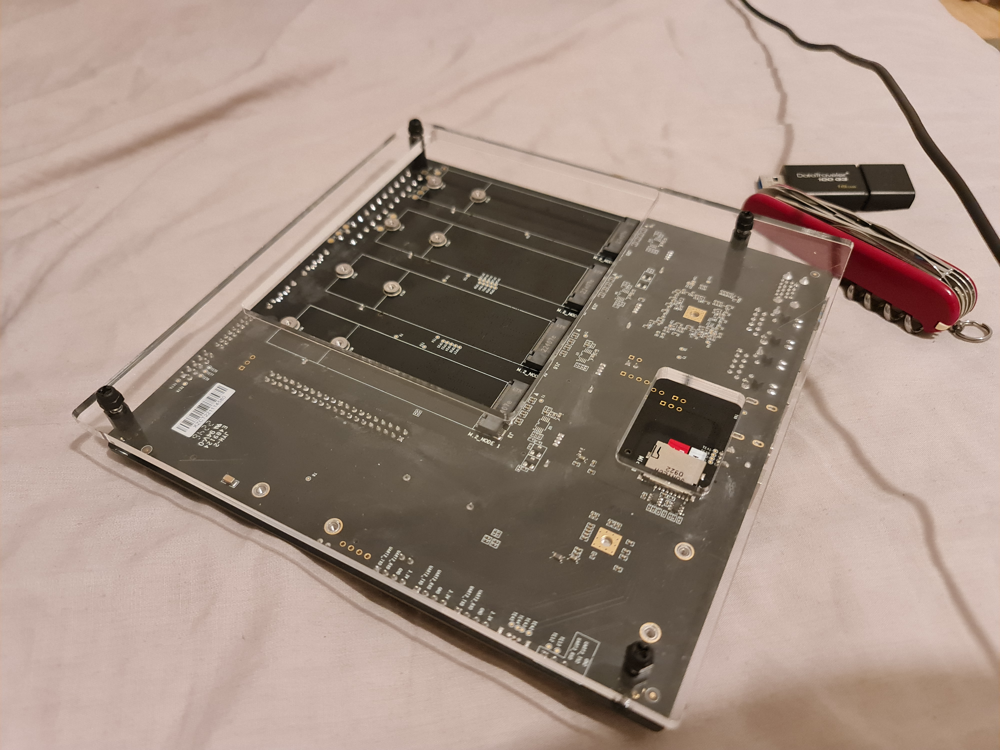

# Setting up the Turing Pi 2



The Turing Pi 2 provides a platform to run 4 nodes with a large variety of IO. They provide good documentation on their website and the relevant pages have been linked to in each section.

It is assumed you are using Linux for this guide but systems such as [WSL](https://learn.microsoft.com/en-us/windows/wsl/install) or windows specific commands are available.

To learn more about the Turing Pi 2 board read the following section on their official documentation: https://docs.turingpi.com/docs/turing-pi2-specs-and-io-ports

There is also a very useful discord forum for further information or to ask questions: https://turingpi.com/help/

## Hardware

Official Turing Pi Docs: https://docs.turingpi.com/docs/turing-pi2-hardware-installation

Installing the nodes is very simple. If using a CM4 board put it on a carrier board ensuring it matcher the outline on the silkscreen then place which ever device you are using into one of the SO-DIMM slots. Which IO is accessible to which slot is described in the official documentation.

#### Controls

There are two buttons on the opposite corner to the ATX power input.

* `KEY1 (1 Second)`: Power on all 4 nodes sequentially.
* `KEY1 (3 Seconds)`: Power off all 4 nodes sequentially.
* `BMC_RESET`: Powers off all nodes and resets the BMC.

---

On BMC firmware 1.1.0 these changed.

* `KEY1 (Short Toggle)`: Turn on/off currently active (set by user) nodes.

* `KEY1 (Long Press)`: Reset active nodes to all off (if 4 nodes on) or all on ( if <=3 nodes on)

* `BMC_RESET`: Powers off all nodes and resets the BMC. Nodes will return to previous power state after BMC boots.

---

#### LEDs

There are many LEDs on the Board that can give feedback on the device.

* `Yellow LED next to slot 1 and the BMC`: Signals network activity for the BMC.
* `Red LED next two each slot`: Indicates if the slot is being powered.
* `Pair of LEDs on the other side of SO-DIMM slot to RED power led`: network link and activity light for the relevant node.
* `Ethernet ports`: Each ethernet port has a link and activity LED.
* `Green LEDs on CM4 carrier boards`: These are a power and activity lights for the CM4 board.
* `Two green LEDs next to 24-pin ATX power input`: One is the PSU is connected to power. The other shows if the PSU has been activated.

The front IO port also provides power and activity led connectors.

#### HDMI output

There is a DIP switch next to the HDMI output. As the Nvidia Jetson and Raspberry Pi have different outputs the device type must be specified on this switch with the following patterns.

* `Raspberry Pi`: 1:ON 2:OFF 3:OFF 4:ON
* `Nvidia Jetson`: 1:OFF 2:ON 3:ON 4:OFF

#### Case

There are many options for cases as the Turing Pi 2 has a standard ITX form factor but I chose to laser cut a piece of acrylic and attach it under the PCB with M3 standoffs and screws.



This had a few problems. The M.2 cut out was not aligned correctly and due to its size I would end up holding the PCB when picking it up. The SD card cutout worked great for taking the card out but was a real pain to get back in.

I plan on re-designing this with a bigger SD card slot and an aligned M.2 cutout as well as an option with no cutout.

## BMC

Official Turing Pi Docs: https://docs.turingpi.com/docs/turing-pi2-bmc-how-to-get-started

#### HTTP interface and API

The BMC will host a HTTP web interface on its IP address which can be used for basic control over the nodes and to update its firmware. It also provides and API which is documented here: https://docs.turingpi.com/docs/turing-pi2-bmc-api#api-endpoints

#### Console

The console can be accessed through serial with a USB-to-TTL cable or through SSH. By default there is root access over SSH but in older versions this was not enabled so a firmware update may be required. The console can be access with these credentials:

* `user`: root
* `password`: turing

To edit files you can use `vi` or on firmware version 1.0.2 or higher `nano`.

On version 1.1.0 `python3` was included.

#### Static IP

You can set a static on the bmc by editing `/etc/network/interfaces` based on this example:

```
# interface file auto-generated by buildroot

auto lo
iface lo inet loopback

auto eth0
iface eth0 inet static
  address <Fixed IP>
  netmask 255.255.255.0
  gateway <Gateway IP>
  pre-up /etc/network/nfs_check
  wait-delay 15
  hostname $(hostname)
```

An alternative is to edit your router to reserve an IP address to the MAC address on your BMC. I use this method as I move bettween houses and it is a pain if another device is already using the static IP on the new network. By reserving the IP on your router it can still get a new IP from the new networks DHCP server preventing clashes.

#### Updating firmware

The firmware can be updated OTA with the HTTP interface but this will only update the file system. To update the kernel follow these instructions: https://docs.turingpi.com/docs/turing-pi2-bmc-update#full-system-update-with-an-image-file

The latest firmware version can be found here: https://github.com/turing-machines/BMC-Firmware/releases

#### $tpi

The `tpi` command can be used on the BMC. For information on its use run:

```shell
tpi -h
```

There is an x86_64 binary available for use on you computer: https://github.com/turing-machines/BMC-Firmware/releases/

#### SSH-Key

SSH keys are recommended instead if password access to improve security. First you need to generate a RSA key on your computer. Run the command and follow the prompts.

```shell
ssh-keygen -t rsa
```

Next you need to copy this to the BMC. Replace with the IP of your BMC.

```shell
ssh-copy-id -i $HOME/.ssh/id_rsa.pub root@<BMC IP Address>
```

You can then disable password authentication but check you can login with and SSH key as you can lock yourself out of SSH if it does not work. To disable password authentication edit `/etc/ssh/sshd_config` and at the bottom of the file set `PasswordAuthentication no`.

## Flashing RPi CM4 eMMC

Official Turing Pi Docs: https://docs.turingpi.com/docs/raspberry-pi-cm4-install-os-using-turing-pi2-cluster

---

__On firmware version 1.1.0 the ability to flash nodes from the BMC and SD card was added. I have not used that method yet but it is an option.__

---

You need to connect the vertical usb port labeled `USB_OTG` next to the HDMI port to your computer. 

__It is recommended you use a USB-A Male-Male cable for this as some you may experience issues with a USB-A to USB-C cable.__

The `rpiboot` driver is required to mount the CM4s eMMC as a drive. Instillation instructions can be found here: https://github.com/raspberrypi/usbboot#building

To run on linux enter:

```shell
sudo ./rpiboot
```

or on windows:

```powershell
rpiboot -d .\msd
```

It should give an output similar to this:

```
RPIBOOT: build-date Dec 16 2022 version 20221215~105525 1afa26c5  
Loading: .\msd/bootcode.bin  
Loading: .\msd/bootcode4.bin  
Waiting for BCM2835/6/7/2711...
```

Ensuring `rpiboot` is running and the device is powered on you need to set the usb mode to device and the slot you wish to flash. The following $tpi command can be used.

```shell
tpi -u device -n 3
```

__There has been some issues getting rpiboot to detect CM4s in slot 1. I was able to flash mine in slot 3. You may need to move you devices to flash them.__

Power of the Pi and then power it on again. The `rpiboot` output should look similar to the following and the eMMC should be mounted as a new drive.

```
RPIBOOT: build-date Dec 16 2022 version 20221215~105525 1afa26c5  
Loading: .\msd/bootcode.bin  
Loading: .\msd/bootcode4.bin  
Waiting for BCM2835/6/7/2711...  
Loading: .\msd/bootcode4.bin  
Loading: .\msd/bootcode4.bin  
Sending bootcode.bin  
Successful read 4 bytes  
Waiting for BCM2835/6/7/2711...  
Loading: .\msd/bootcode4.bin  
Second stage boot server  
Cannot open file config.txt  
Cannot open file pieeprom.sig  
Loading: .\msd/start4.elf  
File read: start4.elf  
Cannot open file fixup4.dat  
Second stage boot server done
```

You can now flash the CM4 as normal with the [Raspberry Pi OS Imager](https://www.raspberrypi.com/software/). It is recommended to use Raspberry Pi OS Lite (64-bit) or DietPi.

If installing DietPi unselect __Eject media when finished__ under Advaced options. After it has finished flashing open the 128MiB drive that is mounted and edit `dietpi.txt`. The options in this file are explained in comments. The following are the changes I make.

```
AUTO_SETUP_NET_HOSTNAME=CM4-<ID>
AUTO_SETUP_HEADLESS=1
AUTO_SETUP_SSH_SERVER_INDEX=-2
AUTO_SETUP_SSH_PUBKEY=<RSA Public Key>
AUTO_SETUP_BROWSER_INDEX=0
AUTO_SETUP_AUTOSTART_TARGET_INDEX=7
AUTO_SETUP_AUTOMATED=1
SURVEY_OPTED_IN=0
CONFIG_G_CHECK_URL_ATTEMPTS=5
SOFTWARE_DISABLE_SSH_PASSWORD_LOGINS=1
```

This uses a SSH-Key to login and disables password authentication so ensure you have the key set correctly. I also removed all but the SSH Server config from the `DietPi-Software settings` section. You can get it to install software on first boot by adding lines under `# Software to automatically install`. Here is what I installed.

```
#OpenSSH Client
AUTO_SETUP_INSTALL_SOFTWARE_ID=0
#Samba Client
AUTO_SETUP_INSTALL_SOFTWARE_ID=1
#Git
AUTO_SETUP_INSTALL_SOFTWARE_ID=17
#vim
AUTO_SETUP_INSTALL_SOFTWARE_ID=20
#RPi.GPIO
AUTO_SETUP_INSTALL_SOFTWARE_ID=69
#OpenSSH Server
AUTO_SETUP_INSTALL_SOFTWARE_ID=105
#Python 3 pip
AUTO_SETUP_INSTALL_SOFTWARE_ID=130
#Docker Compose
AUTO_SETUP_INSTALL_SOFTWARE_ID=134
#Docker 
AUTO_SETUP_INSTALL_SOFTWARE_ID=162
```

You can now power off and on the nodes and they will go through first boot. When I installed DietPi the CM4 would not start the first boot untill the whole TuringPi board had been disconnected and reconnected to power. After that it worked perfectly.